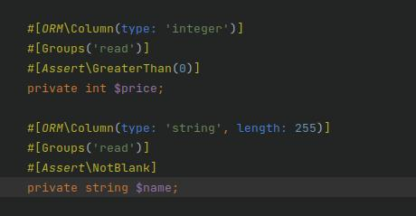

Order API Test App

# Task #


# Database Design #


# API #
Swagger API doc

Api is split for admins and users


Create new order example
example json request: 
```
{"deliveryAddress" : 1,"billingAddress" : 1,"items":[{"id":1,"quantity":2}]}
```


# Command #
Process delayed orders command see: [OrderControllerTest](src/Command/ProcessDelayedOrdersCommand.php)

# Data Validation #
Uses Validation component and forms to ensure valid input
Eg price is above 0, item name is not blank.

See entity attributes


See error response over api


# Unit Tests #
Full unit test for api
see: [OrderControllerTest](tests/OrderControllerTest.php)